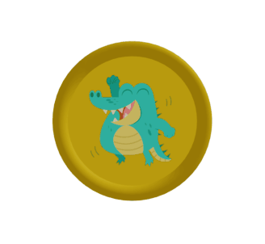

# Codycoin

<p align="center">
    
</p>


Creando una moneda con React + React Three Fiber + Remotion. 

- [Docs de Remotion](https://remotion.dev)
- [Docs de React Three Fiber](https://docs.pmnd.rs/react-three-fiber)
- [Docs de @remotion/three](http://remotion.dev/docs/three)


## Commands

**Instalar dependencias**

```console
npm install
```


**Iniciar preview**

```console
npm start
```


**Renderizar gif**

```console
npm run build
```
